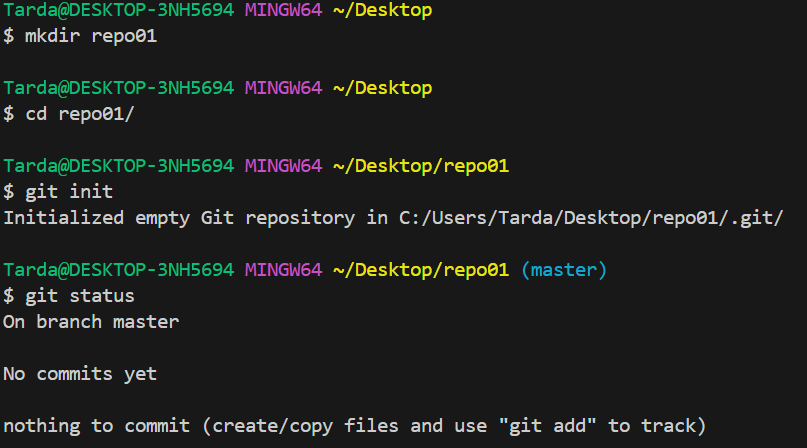
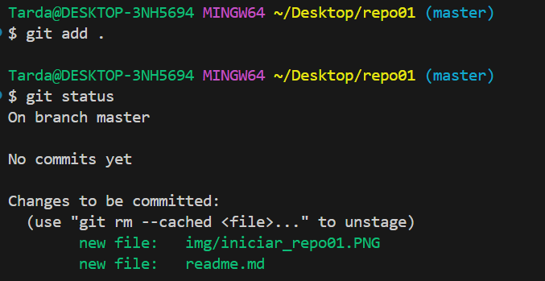
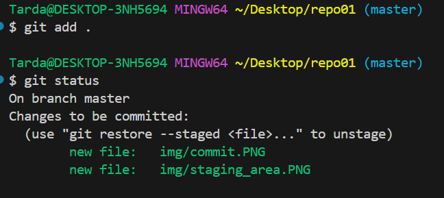
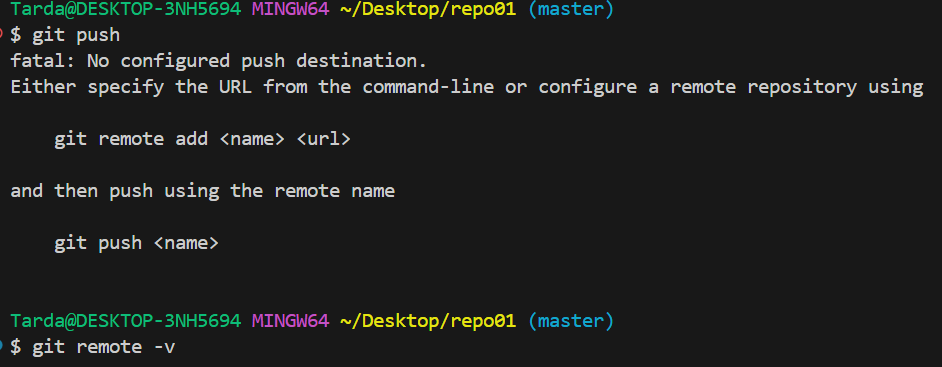
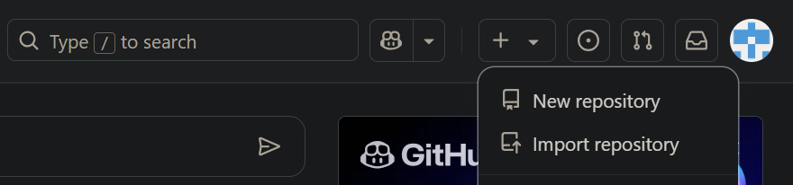
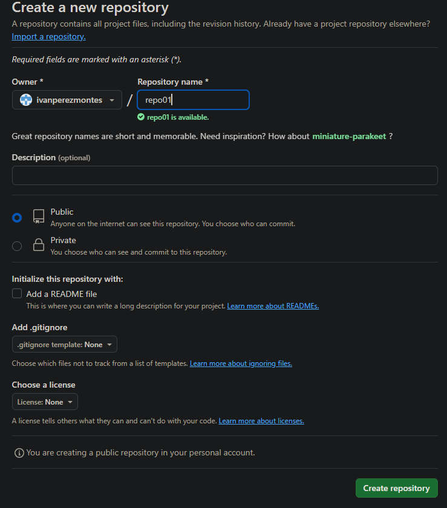
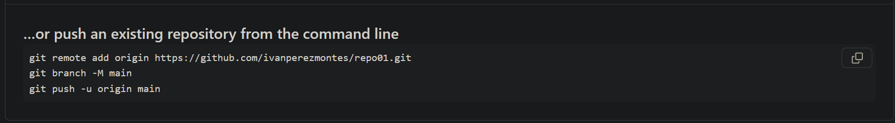
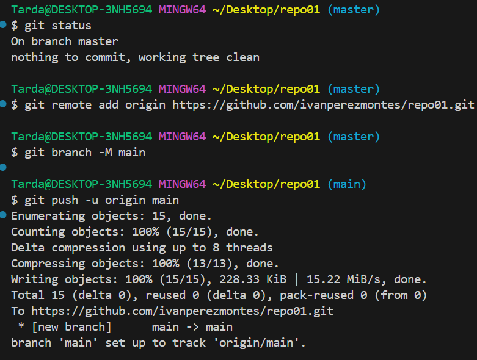

# Creación de repositorio en Git

1. Creación de carpeta e iniciar Git
   
   - `mkdir`para crear una carpeta  
   - `git init` para iniciar git i crear un repositorio

        

 - Vemos que hemos iniciado el repositorio con éxito al hacer `git status`

2. Staging area
   
   - Con `git add .`añadimos el readme.md y la imagen en el *staging area*
  

      

 
    - Hago `git commit -m "Añado el readme.md y las imagenes"` para hacer el snapshot y vemos que tenemos un fichero untracked por la captura que acabo de hacer y no he añadido a *staging area* 
    
       

    - Añado las imagenes que faltan al *staging area* 
    - 

3. Push 
   
     - Hacemos push pero como no hemos indicado el repositorio remoto al que hay que subir los cambios, vamos a crear uno en git-hub para enlazarlo
    
        

    - En git-hub añadimos un nuevo repositorio y lo llamamos como lo tenemos en local para respetar la coherencia 
     
        

        

    - Añadimos la dirección del origen: `git remote add origin https://github.com/ivanperezmontes/repo01.git`  
    -  Cambiamos el nombre de la rama ***master*** a ***main***: `git branch -M main` 
    - Hacemos push: `git push -u origin main`

         
        
