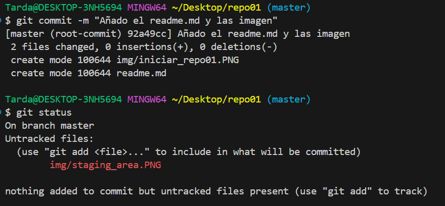

Tabla de contenido
- [Creación de repositorio en Git](#creación-de-repositorio-en-git)
  - [1. Creación de carpeta e iniciar Git en local](#1-creación-de-carpeta-e-iniciar-git-en-local)
  - [2. Staging area](#2-staging-area)
  - [3. Push](#3-push)
  - [4. Repositorio remoto](#4-repositorio-remoto)
  - [5. Iniciar repositorio desde GitHuB](#5-iniciar-repositorio-desde-github)

# Creación de repositorio en Git

## 1. Creación de carpeta e iniciar Git en local
   
   - `mkdir`para crear una carpeta  
   - `git init` para iniciar git i crear un repositorio
   - Vemos que hemos iniciado el repositorio con éxito al hacer `git status`

        

 

## 2. Staging area
   
   - Con `git add .`añadimos el readme.md y la imagen en el *staging area*
  

      

 
- Hago `git commit -m "Añado el readme.md y las imagenes"` para hacer el snapshot y vemos que tenemos un fichero untracked por la captura que acabo de hacer y no he añadido a *staging area* 
    
    

- Añado las imagenes que faltan al *staging area* 
- 

## 3. Push 
   
- Hacemos push pero como no hemos indicado el repositorio remoto al que hay que subir los cambios, vamos a crear uno en GitHub para enlazarlo
    
    

- En GitHub añadimos un nuevo repositorio y lo llamamos como lo tenemos en local para respetar la coherencia 
     
    

    

- Añadimos la dirección del origen: `git remote add origin https://github.com/ivanperezmontes/repo01.git`  
-  Cambiamos el nombre de la rama ***master*** a ***main***: `git branch -M main` 
- Hacemos push: `git push -u origin main`

    
    

## 4. Repositorio remoto
-  Veo que en GitHub se han subido el fichero readme.md y las imagenes
  
    
    
- Hay un problema, no se han subido el fichero readme.md que estaba editando
    
- Guardo el ***readme.md***, lo añado al staging area, commit y push
  
     

- Finalmente vemos el readme en GitHub
    

## 5. Iniciar repositorio desde GitHuB
   - Creo el repositorio desde GitHub
    
    
    
      - He usado regex para cambiar la forma en la que estaba escribiendo "git-hub" a GitHub
        
- Clono el repositorio repo02
        
- Creo readme.md en repo02
        
- Añado al staging area, `git add .`. Hago el commit, `git commit -m "Añado el readme.md"`. Hago push, `git push`
        